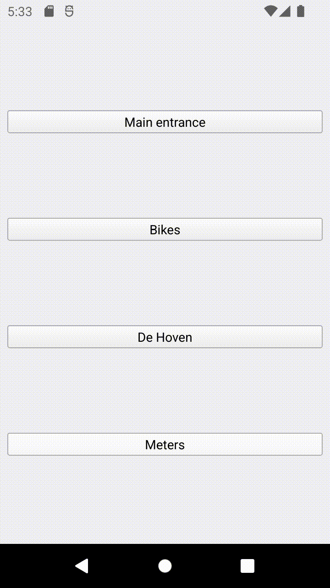

# 4suites Android app

A [KISS](https://en.wikipedia.org/wiki/KISS_principle) frontend to substitute the [official 4suites android app](https://play.google.com/store/apps/details?id=com.foursuites.android&gl=US).

### What's wrong with the official app?
The login isn't persistent and you have to re-login every few days (sometimes hours even...), which kinda defeats the purpose of the "IoT convenience".  
Also the official app has many useless buttons for what it's supposed to be doing: just opening building doors.

### How do you fix this issue?
By making it stupid and simple:  
1. Hardcoded credentials stored in the app - never get logged out again. Under the hood, the credentials are used for token generation every time you launch the app.

2. Use just X buttons for the X doors you are interested in - no more, no less.

All this is possible since the company has an [open API](https://developer.4suiteshq.com/) for the needed requests.

### Building and uploading
Since I'm in the dark with regards to Android/ iOS app development, I used the Qt framework and Qt Creator.  
I've only tested this on Android phones, but should be "plug and play" for iphones also.  

- To set up your environment for Android phones:
https://doc.qt.io/qtcreator/creator-developing-android.html
- To prepare your device:
Enable USB debugging (more info [here](https://developer.android.com/studio/run/device)).

- To deploy it on your target device:  
    1. Fill your credentials in `main.cpp`
    2. Build the project for your phone's architecture (e.g. ARMv7a), using the appropriate kit.
    4. Hit the Run button, and voila!

    

